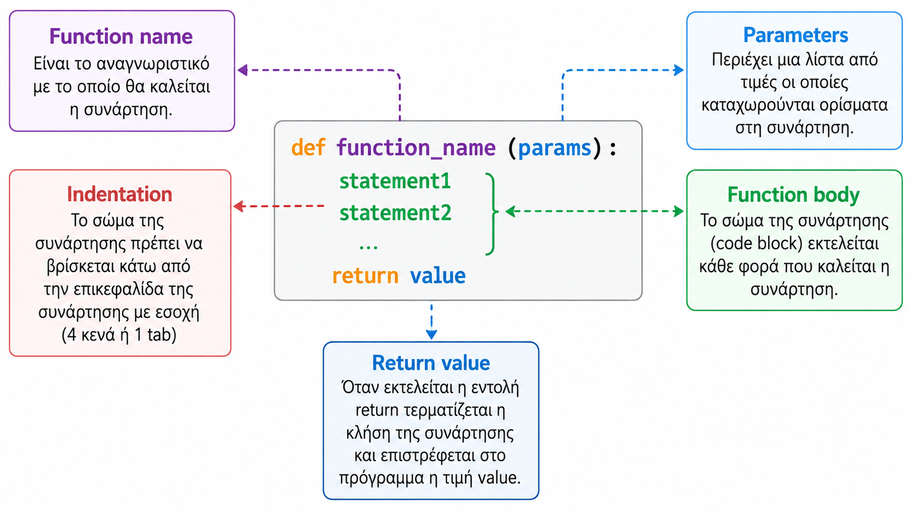

# 🖋️ Python Greeting Function Demonstration 🗨️

Welcome to the Python Greeting Function Demonstration! This script showcases a simple Python function designed to print a greeting message to a specific place. It’s a perfect resource for beginners or educators teaching the fundamentals of function definition, parameter handling, and documentation in Python.


---



---


## Script Overview 📘

The script defines a function `say_hello` that prints a greeting to a specified location, with a default location of "Coding Factory" if no other is specified. The script also demonstrates how to access the function's documentation programmatically, enhancing the understanding of Python docstrings.

### :computer: Script Code

```python
def say_hello(place: str = "Coding Factory"):
    """
    Prints a greeting message.

    Args:
        place (str): The place to greet. Defaults to 'Coding Factory'.
    """
    # Print a greeting message using f-string
    print(f"Hello, {place}!")

def main():
    """
    The main function to execute the program.
    """
    # Call the say_hello function
    say_hello()

    # Print the documentation of the say_hello function
    print("\nFunction Documentation:")
    print(say_hello.__doc__)

# main()

if __name__ == "__main__":
    # Execute the main function if the script is run directly
    main()
```

## Key Features 🌟
- **Function Definition and Defaults**: Learn how to define functions with default parameters.
- **Documentation Strings**: Understand the importance of documenting functions using docstrings.
- **Programmatic Access to Documentation**: Discover how to access a function's documentation within your code, a useful feature for dynamic documentation.

## Technical Requirements 🔧
- **Python Version**: Python 3.x recommended
- **External Libraries**: None

## Installation and Setup 🚀
No installation is required, as the script can be run directly from any Python-enabled environment:
1. Ensure Python 3.x is installed on your machine.
2. Save the script as `11_function_demo.py`.
3. Open a terminal or command prompt.
4. Navigate to the directory containing `11_function_demo.py`.
5. Run the script with: `python 11_function_demo.py`.

## Usage Example 📋
Execute the script to see how the greeting function operates and how to view function documentation. This practical example will help you understand basic concepts in Python programming related to functions.

## 📢 Stay Updated
Be sure to ⭐ this repository to keep up with updates and new learning materials!

## 📄 License
🔐 This project is protected under the [MIT License](https://mit-license.org/).

## Contact 📧
Panagiotis Moschos - pan.moschos86@gmail.com

🔗 *Note: This is a Python script and requires a Python interpreter to run.*

---
<h1 align=center>Happy Coding 👨‍💻 </h1>

<p align="center">
  Made with ❤️ by Panagiotis Moschos (https://github.com/pmoschos)
</p>