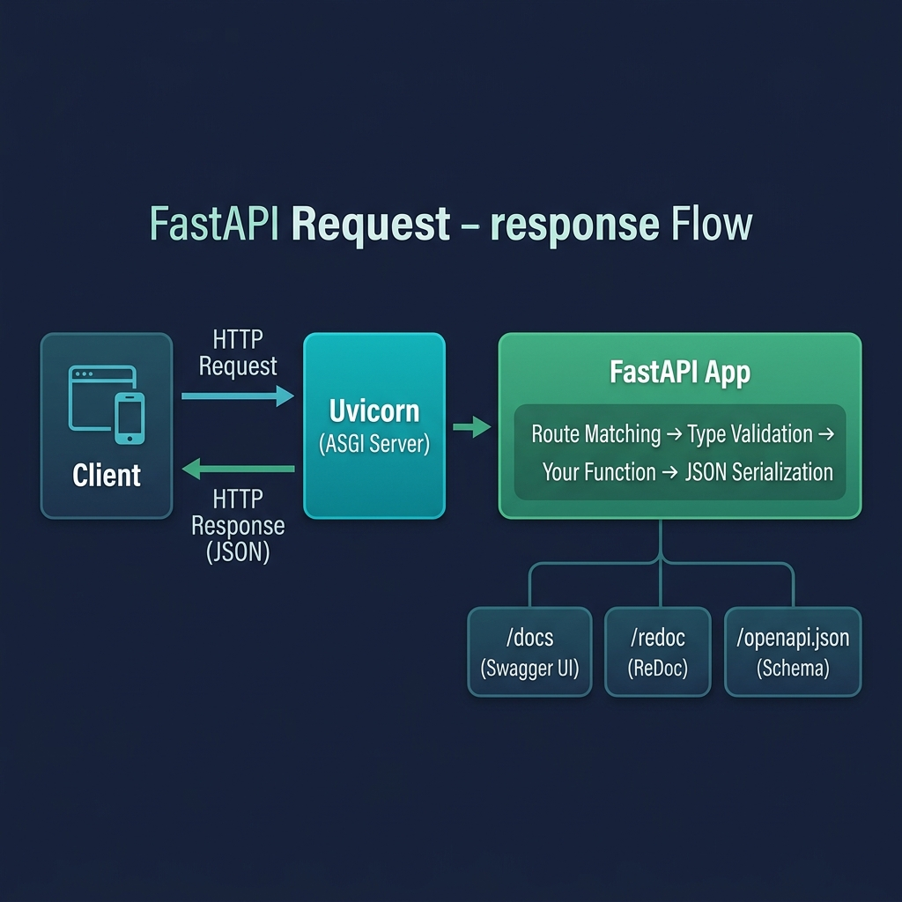

# 01 — Getting Started

<p align="center">
  
</p>

## What You Will Learn

- How to install FastAPI and Uvicorn
- How to create a minimal API with a single endpoint
- How to run the development server with hot-reload
- How to use the automatic interactive docs (`/docs`, `/redoc`)

---

## Installation

FastAPI is installed with pip. The `[standard]` extra includes everything you need:

```bash
pip install "fastapi[standard]"
```

This installs:

| Package | Purpose |
|---------|---------|
| **FastAPI** | The web framework itself |
| **Uvicorn** | ASGI server that runs your app |
| **python-multipart** | Parsing form data and file uploads |
| **email-validator** | Support for `EmailStr` validation |
| **FastAPI CLI** | The `fastapi dev` / `fastapi run` commands |

> **What is ASGI?**
> ASGI (Asynchronous Server Gateway Interface) is the modern Python standard
> for connecting web frameworks to web servers. It supports async, WebSockets,
> and HTTP/2 — unlike the older WSGI standard used by Flask and Django.

---

## Your First App

A FastAPI app is created by instantiating `FastAPI()` and attaching route handlers with decorators:

```python
from fastapi import FastAPI

app = FastAPI()

@app.get("/")
def root():
    return {"message": "Hello, World!"}
```

### What happens here:

1. `FastAPI()` creates an application instance
2. `@app.get("/")` registers a **GET** route at the root path `/`
3. The function `root()` is the **route handler** (also called an endpoint)
4. The return value (a Python `dict`) is **automatically converted to JSON**

### Other HTTP methods:

```python
@app.get("/")        # Read
@app.post("/")       # Create
@app.put("/")        # Full update
@app.patch("/")      # Partial update
@app.delete("/")     # Delete
```

---

## Running the Server

There are two ways to start the development server:

```bash
# Option 1: FastAPI CLI (newer, recommended)
fastapi dev main.py

# Option 2: Uvicorn directly (classic)
uvicorn main:app --reload
```

### Understanding `main:app`

```
uvicorn main:app --reload
        ^^^^  ^^^  ^^^^^^^
         │    │      │
         │    │      └── watch files and restart on changes
         │    └── the variable name of the FastAPI instance
         └── the Python file (main.py, without .py)
```

### Development vs Production

| | Development | Production |
|---|---|---|
| **Command** | `uvicorn main:app --reload` | `uvicorn main:app --workers 4` |
| **Auto-reload** | Yes | No |
| **Performance** | Single process | Multiple workers |
| **Tracebacks** | Detailed | Minimal |

---

## Automatic Documentation

FastAPI generates an **OpenAPI schema** from your code — your type hints, docstrings, and decorators become live documentation automatically.

### Two Built-in UIs

| URL | UI | Best For |
|-----|-----|----------|
| `/docs` | **Swagger UI** | Interactive testing — click "Try it out" to call endpoints |
| `/redoc` | **ReDoc** | Polished reference docs to share with frontend teams |
| `/openapi.json` | Raw JSON | Code generators, API gateways, CI validation |

### Why This Matters

- You never write API documentation manually
- The docs are always in sync with your code
- Frontend developers can explore your API without reading source code
- You can export the schema and generate client SDKs automatically

---

## Minimal Project Layout

```
myapi/
├── .venv/              # Virtual environment (never commit this)
├── main.py             # Your FastAPI app
├── requirements.txt    # Dependencies
└── README.md           # Project description
```

As your project grows, you'll split into multiple files (see Section 10).

---

## Code Examples

→ See `examples/01_getting_started/main.py`
