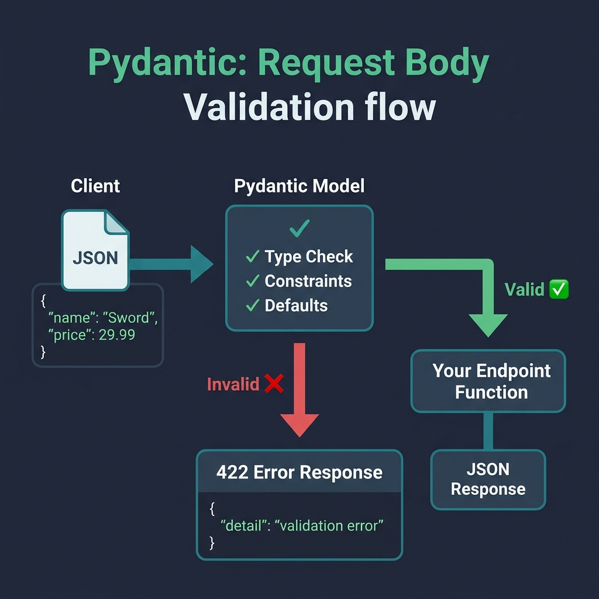

# 03 — Request Bodies with Pydantic

<p align="center">
  
</p>

## What You Will Learn

- How to use Pydantic models to define and validate JSON request bodies
- How FastAPI distinguishes between path, query, and body parameters
- How to add field-level constraints with `Field(...)`
- How to compose nested models
- How to write custom validators with `@field_validator` and `@model_validator`

---

## What is Pydantic?

Pydantic is a data validation library that uses Python type hints to define data schemas. When you inherit from `BaseModel`, every attribute becomes a validated field.

```python
from pydantic import BaseModel

class Item(BaseModel):
    name: str
    price: float
    in_stock: bool = True       # default → optional field
    tags: list[str] = []        # default → optional with empty list
```

### What Pydantic does for you:

1. **Validates types** — rejects `"abc"` for a `float` field
2. **Converts types** — coerces `"42"` to `42` for an `int` field
3. **Provides defaults** — fields with defaults become optional
4. **Generates JSON Schema** — FastAPI uses this for Swagger UI
5. **Gives clear error messages** — tells the client exactly what's wrong

---

## Request Body Declaration

Any Pydantic model used as a function argument is automatically read from the JSON body:

```python
@app.post("/items")
def create_item(item: Item):
    return {"ok": True, "item": item}
```

When a client sends:
```json
POST /items
Content-Type: application/json

{"name": "Sword", "price": 29.99}
```

FastAPI will:
1. Read the JSON body
2. Validate it against the `Item` model
3. Convert it to an `Item` instance
4. Pass it to your function
5. Return `422` with details if validation fails

---

## Mixing Body + Path + Query

FastAPI figures out which is which based on how each parameter is declared:

```python
@app.put("/items/{item_id}")
def update_item(
    item_id: int,              # ← in the path → path parameter
    item: Item,                # ← Pydantic model → body
    notify: bool = False,      # ← not in path, not a model → query
):
    ...
```

### The Rule:

| Declaration | Becomes |
|------------|---------|
| In the URL path `{name}` | **Path parameter** |
| Pydantic `BaseModel` | **Request body** |
| Everything else | **Query parameter** |

---

## Field Validation

Use `Field(...)` from Pydantic for per-field constraints. These appear in the OpenAPI schema and Swagger UI:

```python
from pydantic import BaseModel, Field

class UserCreate(BaseModel):
    username: str = Field(
        min_length=3,
        max_length=20,
        pattern=r"^[a-z0-9_]+$",
        description="Lowercase alphanumeric username",
    )
    age: int = Field(ge=13, le=120, description="User's age")
    email: str = Field(description="Contact email")
```

### Available Constraints

| Constraint | Applies To | Example |
|-----------|-----------|---------|
| `min_length` / `max_length` | strings | `Field(min_length=3)` |
| `pattern` | strings | `Field(pattern=r"^[a-z]+$")` |
| `ge` / `gt` | numbers | `Field(ge=0)` — greater or equal |
| `le` / `lt` | numbers | `Field(le=100)` — less or equal |
| `default` | any | `Field(default="guest")` |
| `description` | any | Shows in Swagger UI |
| `examples` | any | `Field(examples=["alice"])` |

---

## Nested Models

Pydantic models can be composed freely. FastAPI validates and documents them recursively:

```python
class Address(BaseModel):
    street: str
    city: str
    country: str = "US"

class User(BaseModel):
    name: str
    address: Address              # nested model
    tags: list[str] = []          # list of primitives
    scores: dict[str, float] = {} # dict with typed values
```

Client sends:
```json
{
    "name": "Alice",
    "address": {
        "street": "123 Main St",
        "city": "Springfield"
    }
}
```

FastAPI validates the **entire tree** — including the nested `address` object.

---

## Custom Validators

### Field Validator — Validate a Single Field

```python
from pydantic import BaseModel, field_validator

class User(BaseModel):
    email: str

    @field_validator("email")
    @classmethod
    def validate_email(cls, v: str) -> str:
        if "@" not in v:
            raise ValueError("Must contain @")
        return v.strip().lower()     # normalize the value
```

- Runs after type validation
- Can transform the value (lowercase, strip, etc.)
- `raise ValueError(...)` to reject the value

### Model Validator — Validate Across Fields

```python
from pydantic import BaseModel, model_validator

class PasswordReset(BaseModel):
    password: str
    confirm: str

    @model_validator(mode="after")
    def passwords_match(self):
        if self.password != self.confirm:
            raise ValueError("Passwords do not match")
        return self
```

- `mode="after"` runs after all fields are validated
- Has access to all field values via `self`
- Perfect for cross-field validation (password confirm, date ranges, etc.)

---

## Code Examples

→ See `examples/03_request_bodies/`

| File | Concept |
|------|---------|
| `basic_body.py` | Pydantic model as request body |
| `body_path_query.py` | Mixing body + path + query |
| `field_validation.py` | Field constraints |
| `nested_models.py` | Nested Pydantic models |
| `custom_validators.py` | Field and model validators |
