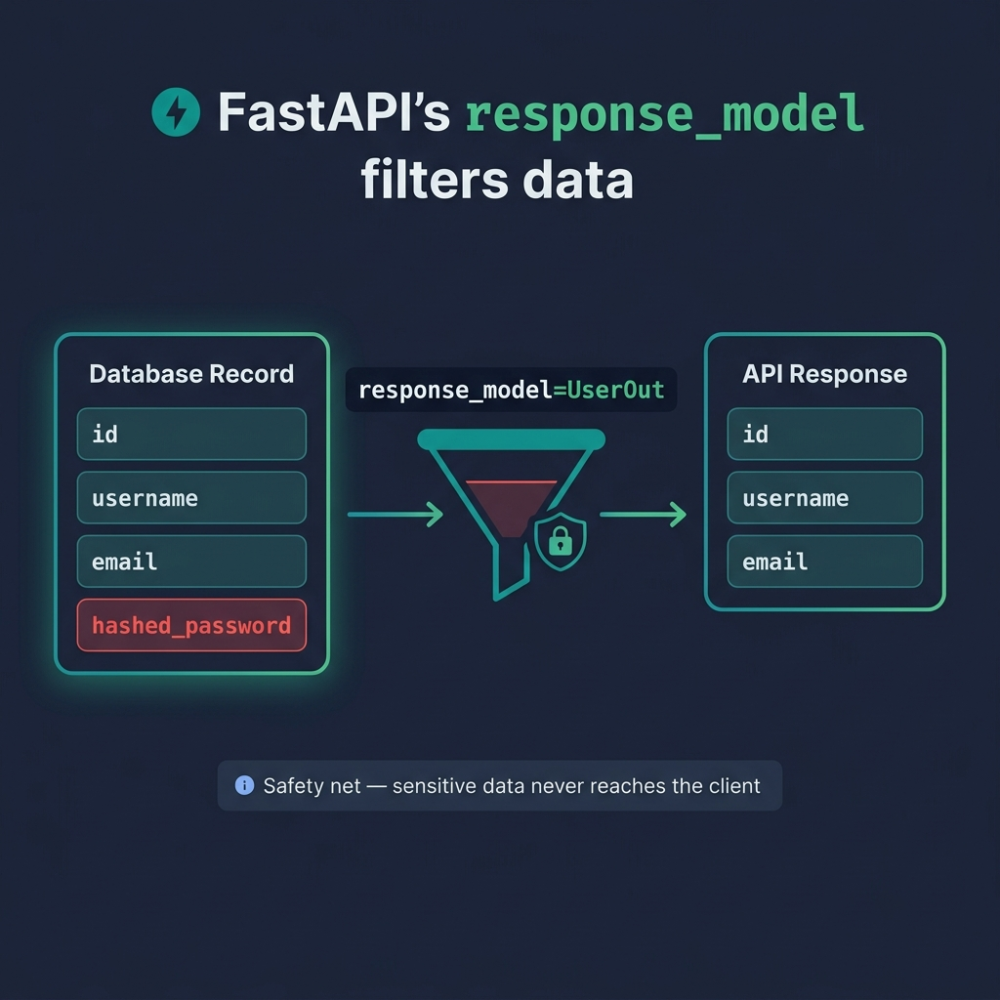

# 04 — Responses & Status Codes

<p align="center">
  
</p>

## What You Will Learn

- How to use `response_model` to filter outgoing data
- How to set custom HTTP status codes
- How to use `response_model_exclude_unset` for partial responses
- How to return HTML, plain text, redirects, and file downloads

---

## Response Models — Controlling Output

### The Problem

Your database model might have sensitive fields (passwords, internal IDs, etc.) that should **never** appear in API responses.

### The Solution: `response_model`

```python
from pydantic import BaseModel

class UserIn(BaseModel):      # what the client sends
    username: str
    password: str
    email: str

class UserOut(BaseModel):     # what the client receives
    username: str
    email: str
    # password is NOT here → it's filtered out

@app.post("/users", response_model=UserOut)
def create_user(user: UserIn):
    return user   # FastAPI strips password automatically
```

### How it works:

1. Your function returns a full object (including password)
2. FastAPI serializes it through `UserOut`
3. Any fields not in `UserOut` are **silently dropped**
4. The client never sees the password

> **This is a safety net.** Even if you accidentally return sensitive data,
> `response_model` ensures it never reaches the client.

---

## Status Codes

HTTP status codes tell the client what happened. FastAPI defaults to `200 OK`, but you should use the correct code for each operation:

### Common Status Codes

| Code | Name | When to Use |
|------|------|-------------|
| `200` | OK | Successful GET, PATCH, general success |
| `201` | Created | Successful POST that created a resource |
| `204` | No Content | Successful DELETE (no body returned) |
| `400` | Bad Request | Invalid input (business logic error) |
| `401` | Unauthorized | Missing or invalid authentication |
| `403` | Forbidden | Authenticated but not allowed |
| `404` | Not Found | Resource doesn't exist |
| `409` | Conflict | Duplicate resource (e.g., username taken) |
| `422` | Unprocessable Entity | Validation error (Pydantic) |
| `500` | Internal Server Error | Unhandled server error |

### Setting Status Codes

```python
from fastapi import status

@app.post("/items", status_code=status.HTTP_201_CREATED)
def create_item(item: Item):
    return item

@app.delete("/items/{item_id}", status_code=204)
def delete_item(item_id: int):
    ...
    # No return value needed for 204
```

> **Tip:** Use `fastapi.status` constants (like `HTTP_201_CREATED`) instead of
> raw numbers. They're more readable and your IDE can autocomplete them.

---

## Response Tuning

### Exclude Unset Fields

`response_model_exclude_unset=True` omits fields that were never explicitly set. Useful for partial responses:

```python
@app.get("/items/{id}", response_model=Item, response_model_exclude_unset=True)
def get_item(id: int):
    # If item.description was never set, it won't appear in the response
    return item
```

### Exclude Specific Fields

```python
@app.get("/users/me", response_model=User, response_model_exclude={"password"})
def me():
    return current_user
```

---

## Custom Response Types

FastAPI returns JSON by default, but you can return other content types:

```python
from fastapi.responses import (
    HTMLResponse,
    PlainTextResponse,
    RedirectResponse,
    FileResponse,
    StreamingResponse,
)
```

### HTML Response

```python
@app.get("/page", response_class=HTMLResponse)
def page():
    return "<h1>Hello from HTML</h1>"
```

### Plain Text Response

```python
@app.get("/health", response_class=PlainTextResponse)
def health():
    return "OK"
```

### Redirect Response

```python
@app.get("/old-page")
def old_page():
    return RedirectResponse(url="/new-page")
```

### File Response

```python
@app.get("/download")
def download():
    return FileResponse("report.pdf", filename="report.pdf")
```

### Streaming Response

```python
@app.get("/stream")
def stream():
    def generate():
        for i in range(100):
            yield f"chunk {i}\n"
    return StreamingResponse(generate(), media_type="text/plain")
```

### Summary Table

| Class | Content-Type | Use Case |
|-------|-------------|----------|
| `JSONResponse` | `application/json` | Default — structured data |
| `HTMLResponse` | `text/html` | Server-rendered HTML pages |
| `PlainTextResponse` | `text/plain` | Health checks, simple text |
| `RedirectResponse` | — | URL redirects (301, 302, 307) |
| `FileResponse` | varies | File downloads |
| `StreamingResponse` | varies | Large data, server-sent events |

---

## Code Examples

→ See `examples/04_responses/`

| File | Concept |
|------|---------|
| `response_model.py` | Filtering with response_model |
| `status_codes.py` | Custom status codes |
| `custom_responses.py` | HTML, plain text, redirect |
