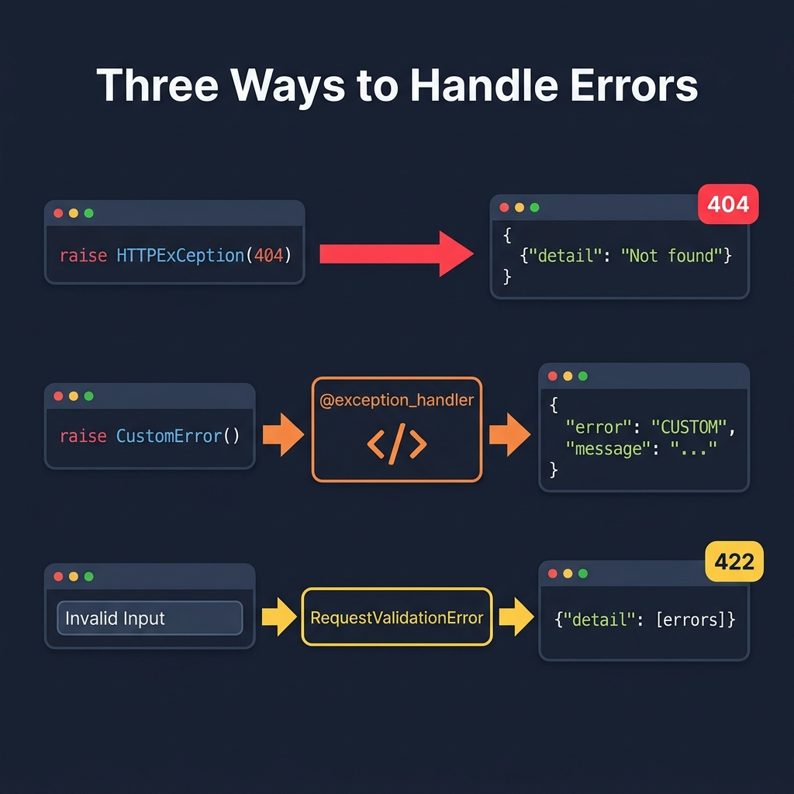

# 05 — Error Handling

<p align="center">
  
</p>

## What You Will Learn

- How to raise `HTTPException` for standard HTTP errors
- How to create custom exception classes and register handlers
- How to override the default Pydantic validation error response

---

## HTTPException

`HTTPException` is the standard way to return HTTP errors in FastAPI. Raise it anywhere in your code — FastAPI catches it and converts it into a proper error response.

```python
from fastapi import HTTPException, status

@app.get("/items/{item_id}")
def get_item(item_id: int):
    item = find_item(item_id)
    if not item:
        raise HTTPException(
            status_code=status.HTTP_404_NOT_FOUND,
            detail="Item not found",
        )
    return item
```

### The response looks like:

```json
HTTP/1.1 404 Not Found
Content-Type: application/json

{
    "detail": "Item not found"
}
```

### Optional: Custom Headers

```python
raise HTTPException(
    status_code=401,
    detail="Invalid token",
    headers={"WWW-Authenticate": "Bearer"},  # standard auth header
)
```

### When to Use HTTPException

| Situation | Status Code | Example |
|-----------|-------------|---------|
| Resource not found | `404` | `raise HTTPException(404, "User not found")` |
| Invalid input (business logic) | `400` | `raise HTTPException(400, "Email already taken")` |
| Not authenticated | `401` | `raise HTTPException(401, "Invalid credentials")` |
| Not authorized | `403` | `raise HTTPException(403, "Admins only")` |
| Conflict | `409` | `raise HTTPException(409, "Username already exists")` |

---

## Custom Exception Handlers

For errors that don't map cleanly to a simple HTTP status code, or when you want a custom error shape, create your own exception class and handler.

### Step 1: Define the Exception

```python
class ItemNotFoundError(Exception):
    """Raised when a requested item doesn't exist."""
    def __init__(self, item_id: int):
        self.item_id = item_id
```

### Step 2: Register the Handler

```python
from fastapi.responses import JSONResponse

@app.exception_handler(ItemNotFoundError)
async def item_not_found_handler(request, exc):
    return JSONResponse(
        status_code=404,
        content={
            "error": "ITEM_NOT_FOUND",
            "message": f"Item {exc.item_id} does not exist",
            "item_id": exc.item_id,
        },
    )
```

### Step 3: Raise It Anywhere

```python
@app.get("/items/{item_id}")
def get_item(item_id: int):
    item = find_item(item_id)
    if not item:
        raise ItemNotFoundError(item_id)   # your custom exception
    return item
```

### Why Use Custom Handlers?

1. **Consistent error shape** — all errors follow the same JSON structure
2. **Rich error data** — include error codes, field names, suggestions
3. **Clean separation** — business logic raises domain exceptions, handlers format them
4. **Centralized logging** — log every error in one place

---

## Overriding Validation Errors

FastAPI uses `RequestValidationError` for Pydantic validation failures (422 errors). You can override the default handler to reshape the response:

### Default Behavior

When validation fails, FastAPI returns:

```json
HTTP/1.1 422 Unprocessable Entity

{
    "detail": [
        {
            "type": "int_parsing",
            "loc": ["path", "item_id"],
            "msg": "Input should be a valid integer",
            "input": "abc"
        }
    ]
}
```

### Custom Override

```python
from fastapi.exceptions import RequestValidationError
from fastapi.responses import JSONResponse

@app.exception_handler(RequestValidationError)
async def validation_handler(request, exc):
    errors = []
    for error in exc.errors():
        errors.append({
            "field": " → ".join(str(loc) for loc in error["loc"]),
            "message": error["msg"],
        })
    return JSONResponse(
        status_code=400,       # 400 instead of 422
        content={
            "error": "VALIDATION_ERROR",
            "details": errors,
        },
    )
```

### When to Override

- You want `400` instead of `422`
- Your frontend expects a specific error format
- You want to simplify the error details for end users
- You want to log validation errors centrally

---

## Error Handling Best Practices

1. **Be specific** — use the correct HTTP status code for each error type
2. **Be consistent** — all errors should have the same JSON shape
3. **Be helpful** — include enough detail for the client to fix the problem
4. **Don't leak internals** — never expose stack traces, SQL queries, or file paths
5. **Log server errors** — 5xx errors should be logged for debugging

---

## Code Examples

→ See `examples/05_errors/`

| File | Concept |
|------|---------|
| `http_exception.py` | Basic HTTPException |
| `custom_handler.py` | Custom exception class + handler |
| `validation_override.py` | Overriding validation error format |

---

## `custom_handler.py` vs `validation_override.py`

Both files use `@app.exception_handler(...)`, but they catch a **different type of exception** and serve a **different purpose**:

|  | `custom_handler.py` | `validation_override.py` |
|---|---|---|
| **What it catches** | `BusinessError` — a **custom** exception class you define yourself | `RequestValidationError` — a **built-in** FastAPI/Pydantic exception |
| **When it fires** | When **your code** explicitly calls `raise BusinessError(...)` | **Automatically** by FastAPI, when input fails validation (e.g. `GET /items/abc` where an `int` is expected) |
| **Purpose** | Create your own error type for **business logic** (e.g. "quantity ≤ 0") | **Replace** the default 422 response format that FastAPI sends |
| **Status code** | `422` (your choice) | `400` (overrides the default 422 → 400) |
| **Response shape** | `{"code": "INVALID_QTY", "message": "..."}` | `{"error": "invalid_request", "issues": [...]}` |

### In short

- **`custom_handler.py`** → "I create my own exception and decide how it looks to the client."
- **`validation_override.py`** → "I change the shape of the errors that FastAPI already sends automatically for bad input."
