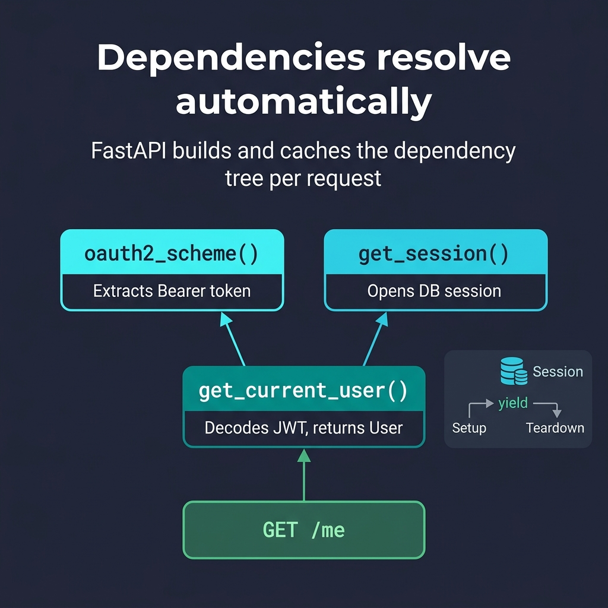

# 06 — Dependency Injection

<p align="center">
  
</p>

## What You Will Learn

- What dependency injection is and why FastAPI's DI system is powerful
- How to create function, class, and yield-based dependencies
- How to chain dependencies (dependencies that depend on other dependencies)
- How to apply dependencies globally
- How to override dependencies in tests

---

## What is Dependency Injection?

Dependency Injection (DI) is a design pattern where a function **declares** what it needs, and the framework **provides** it automatically.

In FastAPI, dependencies are functions that run **before** your endpoint. They can:

| Capability | Example |
|-----------|---------|
| **Share logic** | Reuse pagination, filters, auth across many endpoints |
| **Manage resources** | Open/close DB sessions, file handles, HTTP clients |
| **Enforce security** | Block unauthenticated users before the endpoint runs |
| **Auto-document** | Dependency parameters appear in Swagger UI |
| **Improve testability** | Swap real deps for fakes in tests |

---

## Function Dependencies

Any callable (function, lambda, class) can be a dependency. Use `Depends()` to inject it:

```python
from typing import Annotated
from fastapi import Depends, Query

def pagination(
    skip: int = Query(default=0, ge=0),
    limit: int = Query(default=10, ge=1, le=100),
) -> dict:
    return {"skip": skip, "limit": limit}

# Create a reusable type alias
Page = Annotated[dict, Depends(pagination)]

@app.get("/items")
def list_items(page: Page):
    # page = {"skip": 0, "limit": 10}
    ...

@app.get("/users")
def list_users(page: Page):
    # Same pagination logic, reused
    ...
```

### What Happens at Runtime:

1. Client calls `GET /items?skip=20&limit=5`
2. FastAPI sees `Page` depends on `pagination()`
3. FastAPI calls `pagination(skip=20, limit=5)`
4. The result `{"skip": 20, "limit": 5}` is passed to `list_items()`
5. `skip` and `limit` appear in Swagger UI automatically

---

## Class Dependencies

Classes give you **typed attributes** instead of dictionaries — better for IDE support and readability:

```python
class Pager:
    def __init__(self, skip: int = 0, limit: int = 10):
        self.skip = skip
        self.limit = limit

PagerDep = Annotated[Pager, Depends()]

@app.get("/items")
def list_items(pager: PagerDep):
    items = db[pager.skip : pager.skip + pager.limit]
    return items
```

> **Note:** `Depends()` with no argument uses the type hint itself as the dependency.
> FastAPI calls `Pager(skip=..., limit=...)` automatically.

---

## Yield Dependencies (Setup / Teardown)

Use `yield` for resources that need **cleanup after the request** — this is the standard pattern for database sessions:

```python
def get_db():
    db = SessionLocal()      # Setup: open connection
    try:
        yield db             # The endpoint uses the session here
    finally:
        db.close()           # Teardown: close connection (always runs)
```

### Execution Flow:

```
Request arrives
    │
    ├── get_db() runs up to `yield` ──→ session is created
    │
    ├── endpoint function runs ──→ uses the session
    │
    ├── get_db() continues after `yield` ──→ session is closed
    │
Response sent
```

### Common Use Cases for Yield Dependencies:

| Resource | Setup | Teardown |
|----------|-------|----------|
| Database session | `Session(engine)` | `session.close()` |
| File handle | `open(path)` | `file.close()` |
| HTTP client | `httpx.Client()` | `client.close()` |
| Redis connection | `redis.connect()` | `conn.close()` |
| Temp directory | `tempfile.mkdtemp()` | `shutil.rmtree(dir)` |

---

## Dependency Chains

Dependencies can depend on **other dependencies**. FastAPI resolves the full dependency graph:

```python
def get_db():
    db = SessionLocal()
    try:
        yield db
    finally:
        db.close()

def get_current_user(
    token: str,
    db: Session = Depends(get_db),  # depends on get_db
):
    user = db.query(User).filter_by(token=token).first()
    if not user:
        raise HTTPException(401)
    return user

@app.get("/me")
def me(user: User = Depends(get_current_user)):
    # FastAPI resolves: get_db() → get_current_user() → me()
    return user
```

### Caching Within a Request:

If two dependencies share a common sub-dependency, FastAPI calls it **only once** per request and caches the result. This prevents opening two DB sessions for the same request.

---

## Global Dependencies

Apply dependencies to **all routes** in the app:

```python
app = FastAPI(dependencies=[Depends(verify_api_key)])
```

Or to a specific router:

```python
router = APIRouter(dependencies=[Depends(require_auth)])
```

Global dependencies are useful for:
- API key validation
- Rate limiting
- Request logging
- Authentication on all routes

---

## Overriding Dependencies in Tests

This is one of the most powerful features of FastAPI's DI system:

```python
def override_get_db():
    # Use in-memory SQLite for tests
    yield test_session

app.dependency_overrides[get_db] = override_get_db

# Run tests...

app.dependency_overrides.clear()  # always clean up!
```

→ See Section 12 (Testing) for complete examples.

## Parameterised Dependencies (Dependency Factories)

Sometimes you need the **same kind** of check but with **different parameters** — for example, checking if a user has a specific role. A **dependency factory** is a function that *returns* a dependency function:

```python
def require_role(*allowed_roles: str):
    """Returns a dependency that checks the user's role."""
    def role_checker(user: CurrentUser) -> dict:
        if user["role"] not in allowed_roles:
            raise HTTPException(403, "Not allowed")
        return user
    return role_checker
```

Use it like this — each call creates a **different** dependency:

```python
@app.get("/admin")
def admin(user = Depends(require_role("admin"))):
    ...

@app.get("/reports")
def reports(user = Depends(require_role("admin", "viewer"))):
    ...
```

### How the 3-Level Chain Works:

```
Request with X-Token header
    │
    ├── get_token()          → validates token, returns it
    │       │
    ├── get_current_user()   → looks up user in DB using the token
    │       │
    ├── require_role(...)()  → checks if user's role is allowed
    │       │
    └── endpoint runs        → receives the verified user
```

### Factory vs Regular Dependency:

| Type | What you pass to `Depends()` | Use case |
|------|-----|----------|
| Regular | `Depends(get_current_user)` | Same check every time |
| Factory | `Depends(require_role("admin"))` | Same *kind* of check, different *parameters* |

---

## Code Examples

→ See `examples/06_dependencies/`

| File | Concept |
|------|---------|
| `simple_dependency.py` | Function deps with `Annotated` + `Depends` |
| `class_dependency.py` | Class-based deps |
| `yield_dependency.py` | Yield for setup/teardown |
| `dependency_chain.py` | Chained deps, global deps |
| `dependency_chain_improved.py` | 3-level chain with role-based access + dependency factory |
