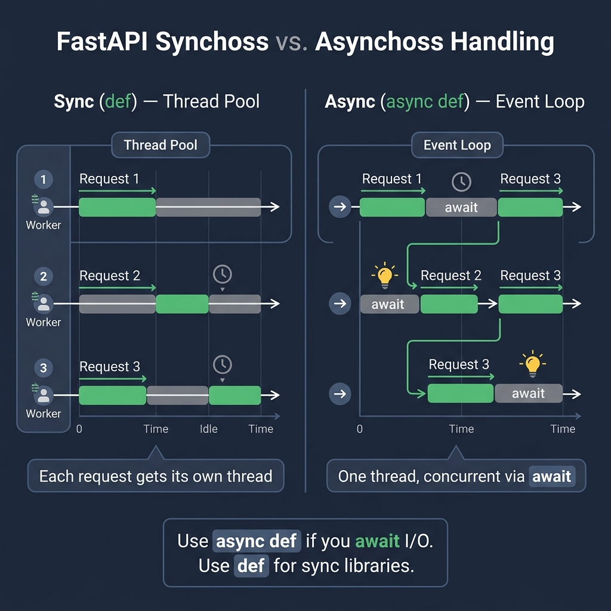

# 07 — Async & Concurrency

<p align="center">
  
</p>

## What You Will Learn

- The difference between `def` and `async def` endpoints
- When to use sync vs async
- How FastAPI handles sync endpoints (threadpool) vs async endpoints (event loop)
- How to run fire-and-forget work with `BackgroundTasks`

---

## Understanding Async in FastAPI

FastAPI is built on top of **Starlette**, which runs on an **async event loop** (powered by `asyncio`). But you don't have to write async code — FastAPI supports both `def` and `async def` endpoints.

---

## `def` vs `async def`

Both work in FastAPI, but the framework handles them **very differently** under the hood:

### Sync Endpoints (`def`)

```python
@app.get("/sync")
def sync_endpoint():
    time.sleep(1)       # this is fine — runs in a thread
    return {"mode": "sync"}
```

- Runs in a **threadpool worker** (not on the event loop)
- **Never blocks** other requests
- Safe to call sync libraries (requests, psycopg2, file I/O)
- FastAPI automatically moves it off the event loop

### Async Endpoints (`async def`)

```python
@app.get("/async")
async def async_endpoint():
    await asyncio.sleep(1)   # non-blocking sleep
    return {"mode": "async"}
```

- Runs **directly on the event loop**
- Must use `await` for all I/O operations
- If you forget `await` or call a blocking function, you **freeze the entire server**

---

## When to Use Which

### Decision Table

| Your Code Uses | Use | Why |
|---------------|-----|-----|
| `httpx.AsyncClient` | `async def` | Async HTTP client |
| `asyncpg`, `aioredis` | `async def` | Async DB/cache drivers |
| `asyncio.sleep()` | `async def` | Non-blocking delay |
| `requests.get()` | `def` | Sync HTTP library |
| `psycopg2`, `pymysql` | `def` | Sync DB drivers |
| `time.sleep()` | `def` | Blocking sleep |
| CPU-heavy computation | `def` | Threadpool handles it |
| SQLModel with sync engine | `def` | Sync ORM |

### The Rule of Thumb

> **Use `async def` if you're `await`-ing something.**
> **Use `def` for everything else.**

If unsure, use `def` — it's always safe because FastAPI runs it in a thread.

---

## The Danger of Blocking in Async

This is the **#1 async mistake** in FastAPI:

```python
# BAD — blocks the entire event loop!
@app.get("/bad")
async def bad_endpoint():
    time.sleep(5)           # blocks ALL other requests for 5 seconds
    return {"status": "done"}

# GOOD — uses async sleep
@app.get("/good")
async def good_endpoint():
    await asyncio.sleep(5)  # non-blocking, other requests continue
    return {"status": "done"}

# ALSO GOOD — use def, FastAPI handles it in a thread
@app.get("/also-good")
def also_good_endpoint():
    time.sleep(5)           # runs in threadpool, doesn't block
    return {"status": "done"}
```

### How the Event Loop Works

```
Event Loop (single thread)
├── handles request A (async)
├── request A calls await httpx.get() → paused, loop continues
├── handles request B (async)
├── request B calls await db.fetch() → paused, loop continues
├── request A's HTTP response arrives → resumed
├── request B's DB result arrives → resumed
└── both responses sent
```

If you call `time.sleep(5)` in an `async def`, the loop **cannot** switch to other requests during those 5 seconds.

---

## Background Tasks

`BackgroundTasks` runs work **after** the response is sent to the client. The client doesn't wait for it.

```python
from fastapi import BackgroundTasks

def write_log(message: str):
    with open("log.txt", "a") as f:
        f.write(f"{message}\n")

@app.post("/send-notification")
def send_notification(email: str, bg: BackgroundTasks):
    bg.add_task(write_log, f"Notification sent to {email}")
    return {"status": "queued"}   # client gets this immediately
```

### Execution Flow

```
Client sends POST /send-notification
    │
    ├── endpoint runs → returns {"status": "queued"}
    │
    ├── response sent to client ← client is done here
    │
    └── background task runs → write_log("Notification sent to...")
```

### Good Use Cases for BackgroundTasks

| Use Case | Why Background? |
|----------|----------------|
| Logging to file | Client doesn't need to wait |
| Sending emails | Email delivery is slow |
| Webhooks | Calling external services |
| Analytics | Non-critical data collection |
| Light cleanup | Temporary file deletion |

### When NOT to Use BackgroundTasks

For heavy or critical workloads, use a proper task queue:

| Tool | Best For |
|------|----------|
| **Celery** | Production job queues with retries, scheduling |
| **RQ (Redis Queue)** | Simple Redis-based task queue |
| **Dramatiq** | Modern alternative to Celery |
| **Arq** | Async-native task queue |

---

## Code Examples

→ See `examples/07_async/`

| File | Concept |
|------|---------|
| `sync_vs_async.py` | Comparing `def` and `async def` |
| `background_tasks.py` | BackgroundTasks example |
