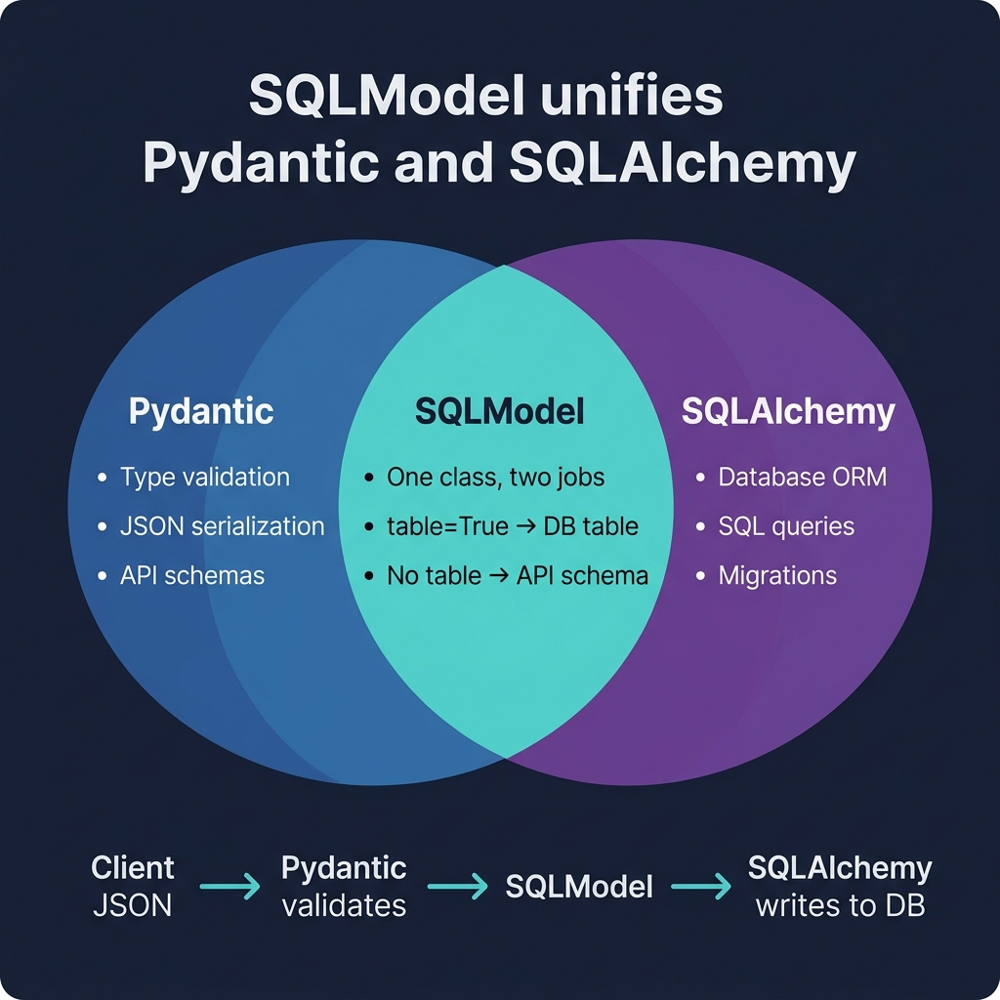

# 08 — Database with SQLModel

<p align="center">
  
</p>

## What You Will Learn

- What SQLModel is and how it combines Pydantic + SQLAlchemy
- How to define table models with `SQLModel` and `table=True`
- How to set up an engine, session, and `create_all`
- How to use lifespan events to create tables on startup
- How to implement full CRUD (Create, Read, Update, Delete)
- How to define one-to-many relationships

---

## What is SQLModel?

SQLModel is a library created by the same author as FastAPI (Sebastián Ramírez). It combines **Pydantic** (data validation) and **SQLAlchemy** (database ORM) into a single class:

```
SQLModel = Pydantic + SQLAlchemy
         = Validation + Database
         = One class, two jobs
```

### Why SQLModel?

| Without SQLModel | With SQLModel |
|-----------------|---------------|
| Separate Pydantic model + SQLAlchemy model | One class does both |
| Manual data conversion between layers | Automatic |
| Duplicated field definitions | Define fields once |
| Two libraries to learn | One unified API |

---

## Table Models vs Schema Models

The `table=True` parameter is what separates database tables from plain validation schemas:

```python
from sqlmodel import Field, SQLModel

# This IS a database table (table=True)
class Hero(SQLModel, table=True):
    id: int | None = Field(default=None, primary_key=True)
    name: str = Field(index=True)
    power: str
    age: int | None = None

# This is NOT a table — it's a Pydantic schema for API input
class HeroCreate(SQLModel):
    name: str
    power: str
    age: int | None = None

# This is NOT a table — it's a Pydantic schema for API output
class HeroRead(SQLModel):
    id: int
    name: str
    power: str
    age: int | None = None
```

### Field Options

| Option | Meaning | Example |
|--------|---------|---------|
| `primary_key=True` | Primary key column | `id: int = Field(primary_key=True)` |
| `index=True` | Create a database index for faster lookups | `name: str = Field(index=True)` |
| `unique=True` | Column value must be unique | `email: str = Field(unique=True)` |
| `default=None` | Default value | `age: int \| None = Field(default=None)` |
| `foreign_key="table.col"` | Foreign key reference | `team_id: int = Field(foreign_key="team.id")` |

---

## Engine & Session

### Engine — The Connection Pool

One engine per application process. It manages a pool of database connections:

```python
from sqlmodel import create_engine

DATABASE_URL = "sqlite:///./database.db"

engine = create_engine(
    DATABASE_URL,
    echo=False,                                    # set True to see SQL queries
    connect_args={"check_same_thread": False},     # required for SQLite
)
```

> **Why `check_same_thread=False`?**
> SQLite by default only allows the thread that created a connection to use it.
> FastAPI uses multiple threads, so we need to disable this check.

### Session — One Per Request

A session represents a single "conversation" with the database. Create one per request using a dependency:

```python
from sqlmodel import Session

def get_session():
    with Session(engine) as session:
        yield session          # the endpoint uses the session
        # session is automatically closed after the request

SessionDep = Annotated[Session, Depends(get_session)]
```

---

## Lifespan Events — Table Creation

Use the `lifespan` handler to create tables once on startup:

```python
from contextlib import asynccontextmanager

@asynccontextmanager
async def lifespan(app: FastAPI):
    SQLModel.metadata.create_all(engine)     # create tables if they don't exist
    print("Database ready")
    yield
    print("Shutting down")

app = FastAPI(lifespan=lifespan)
```

> **Production note:** `create_all` is fine for development. In production,
> use **Alembic** for proper schema migrations that can add columns,
> rename tables, and roll back changes safely.

---

## CRUD Operations

### Create

```python
@app.post("/heroes", status_code=201)
def create_hero(hero: HeroCreate, session: SessionDep):
    db_hero = Hero.model_validate(hero)    # convert schema → table model
    session.add(db_hero)                   # stage the insert
    session.commit()                       # execute the INSERT
    session.refresh(db_hero)               # reload with generated id
    return db_hero
```

### Read (List with Pagination)

```python
@app.get("/heroes")
def list_heroes(session: SessionDep, skip: int = 0, limit: int = 20):
    statement = select(Hero).offset(skip).limit(limit)
    return session.exec(statement).all()
```

### Read (Single by ID)

```python
@app.get("/heroes/{hero_id}")
def get_hero(hero_id: int, session: SessionDep):
    hero = session.get(Hero, hero_id)      # lookup by primary key
    if not hero:
        raise HTTPException(404, "Hero not found")
    return hero
```

### Update (Partial with PATCH)

```python
@app.patch("/heroes/{hero_id}")
def update_hero(hero_id: int, patch: HeroUpdate, session: SessionDep):
    hero = session.get(Hero, hero_id)
    if not hero:
        raise HTTPException(404, "Hero not found")

    update_data = patch.model_dump(exclude_unset=True)  # only changed fields
    for field, value in update_data.items():
        setattr(hero, field, value)

    session.add(hero)
    session.commit()
    session.refresh(hero)
    return hero
```

> **Why `exclude_unset=True`?** Without it, fields the client didn't send would
> be set to `None`, overwriting existing values. `exclude_unset` only includes
> fields that were explicitly provided in the request.

### Delete

```python
@app.delete("/heroes/{hero_id}", status_code=204)
def delete_hero(hero_id: int, session: SessionDep):
    hero = session.get(Hero, hero_id)
    if not hero:
        raise HTTPException(404, "Hero not found")
    session.delete(hero)
    session.commit()
```

---

## Relationships

One-to-many relationship between Team and Hero:

```python
from sqlmodel import Relationship

class Team(SQLModel, table=True):
    id: int | None = Field(default=None, primary_key=True)
    name: str
    heroes: list["Hero"] = Relationship(back_populates="team")

class Hero(SQLModel, table=True):
    id: int | None = Field(default=None, primary_key=True)
    name: str
    power: str
    team_id: int | None = Field(default=None, foreign_key="team.id")
    team: Team | None = Relationship(back_populates="heroes")
```

### How Relationships Work:

```
Team (id=1, name="Avengers")
  │
  ├── Hero (id=1, name="Iron Man",  team_id=1)
  ├── Hero (id=2, name="Thor",      team_id=1)
  └── Hero (id=3, name="Hulk",      team_id=1)
```

- `hero.team` → returns the Team object
- `team.heroes` → returns a list of Hero objects
- `back_populates` keeps both sides in sync

---

## Code Examples

→ See `examples/08_database/`

| File | Concept |
|------|---------|
| `models.py` | Hero + Team SQLModel definitions |
| `db.py` | Engine, session, `create_all` |
| `main.py` | Full CRUD app with lifespan |
| `enhanced_implementations/hero_api/` | Multi-file refactored version |
