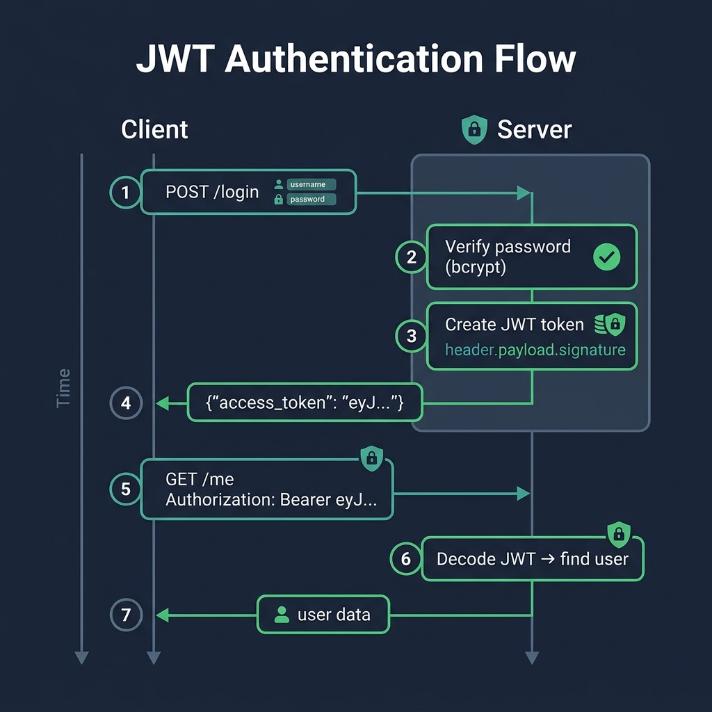

# 09 — Authentication with JWT

<p align="center">
  
</p>

## What You Will Learn

- The OAuth2 password flow: credentials in → token out → token on every request
- How to hash passwords securely with bcrypt
- How to create and verify JWT tokens
- How to build a login endpoint
- How to create a `get_current_user` dependency
- How to protect endpoints with authentication and authorization

---

## The Authentication Flow

```
┌──────────┐                          ┌──────────┐
│  Client  │                          │  Server  │
└────┬─────┘                          └────┬─────┘
     │                                     │
     │  1. POST /register                  │
     │     {"username", "password"}  ────→ │  hash password, store in DB
     │                                     │
     │  2. POST /login                     │
     │     {"username", "password"}  ────→ │  verify password
     │                                     │  create JWT token
     │  ←── {"access_token": "eyJ..."}  ───│
     │                                     │
     │  3. GET /me                         │
     │     Authorization: Bearer eyJ... ─→ │  decode JWT
     │                                     │  look up user
     │  ←── {"username": "alice"}  ────────│
     │                                     │
```

### The Flow in Words:

1. **Register** — client sends username + password → server hashes password and stores it
2. **Login** — client sends credentials → server verifies and returns a JWT token
3. **Authenticated requests** — client sends the token in the `Authorization` header → server decodes it to identify the user

---

## Password Hashing

### Why Hash?

**Never store plaintext passwords.** If your database is compromised, attackers get every user's password. Hashing is a one-way function — you can verify a password against its hash, but you can't reverse the hash.

### bcrypt with passlib

```python
from passlib.context import CryptContext

pwd_context = CryptContext(schemes=["bcrypt"], deprecated="auto")

# Hash a password (during registration)
hashed = pwd_context.hash("my-secret-password")
# → "$2b$12$LJ3m4ys2Kn3N7..."   (60-char hash)

# Verify a password (during login)
pwd_context.verify("my-secret-password", hashed)   # → True
pwd_context.verify("wrong-password", hashed)        # → False
```

### Why bcrypt?

| Property | Why It Matters |
|----------|---------------|
| **Slow by design** | Makes brute-force attacks impractical |
| **Built-in salt** | Each hash is unique, even for identical passwords |
| **Configurable cost** | Increase rounds as hardware gets faster |
| **Industry standard** | Widely used and well-audited |

---

## JWT (JSON Web Tokens)

### What is a JWT?

A JWT is a self-contained, signed token with three parts:

```
eyJhbGciOiJIUzI1NiJ9.eyJzdWIiOiJhbGljZSIsImV4cCI6MTcxNH0.signature
└──────── header ────────┘└────────── payload ──────────────────┘└── sig ──┘
```

| Part | Contains | Purpose |
|------|----------|---------|
| **Header** | Algorithm, token type | How the token is signed |
| **Payload** | `sub`, `exp`, custom claims | Who the user is, when it expires |
| **Signature** | HMAC hash | Proves the token wasn't tampered with |

### Creating a Token

```python
from jose import jwt
from datetime import datetime, timedelta, timezone

SECRET_KEY = "your-secret-key"
ALGORITHM = "HS256"

def create_access_token(username: str) -> str:
    now = datetime.now(timezone.utc)
    expire = now + timedelta(minutes=30)

    payload = {
        "sub": username,    # subject — identifies the user
        "iat": now,         # issued at
        "exp": expire,      # expiration time
    }

    return jwt.encode(payload, SECRET_KEY, algorithm=ALGORITHM)
```

### Decoding a Token

```python
def decode_token(token: str) -> dict:
    payload = jwt.decode(token, SECRET_KEY, algorithms=[ALGORITHM])
    return payload   # {"sub": "alice", "iat": ..., "exp": ...}
```

If the token is expired, tampered with, or signed with a different key, `jwt.decode()` raises an exception.

### JWT vs Sessions

| | JWT (Token-based) | Sessions (Server-side) |
|---|---|---|
| **State** | Stateless — token contains all info | Stateful — session ID references server storage |
| **Scalability** | Easy — any server can verify | Hard — need shared session store |
| **Revocation** | Hard — token valid until expiry | Easy — delete from session store |
| **Best for** | APIs, microservices, mobile apps | Traditional web apps with cookies |

---

## OAuth2PasswordBearer

FastAPI's `OAuth2PasswordBearer` is a dependency that:

1. Reads the `Authorization: Bearer <token>` header
2. Extracts the token string
3. Integrates with Swagger UI's "Authorize" button

```python
from fastapi.security import OAuth2PasswordBearer

oauth2_scheme = OAuth2PasswordBearer(tokenUrl="login")
# tokenUrl tells Swagger UI where to send the login form
```

---

## The `get_current_user` Dependency

This is the core of authentication — a dependency that decodes the token and returns the user:

```python
def get_current_user(
    token: Annotated[str, Depends(oauth2_scheme)],
    session: SessionDep,
) -> User:
    credentials_exception = HTTPException(
        status_code=401,
        detail="Could not validate credentials",
        headers={"WWW-Authenticate": "Bearer"},
    )

    try:
        payload = jwt.decode(token, SECRET_KEY, algorithms=[ALGORITHM])
        username = payload.get("sub")
        if not username:
            raise credentials_exception
    except JWTError:
        raise credentials_exception

    user = session.exec(select(User).where(User.username == username)).first()
    if user is None:
        raise credentials_exception

    return user

# Reusable type alias
CurrentUser = Annotated[User, Depends(get_current_user)]
```

---

## Protecting Endpoints

### Any Authenticated User

```python
@app.get("/me")
def me(user: CurrentUser):
    return {"username": user.username, "is_admin": user.is_admin}
```

### Admin Only (Role-Based Access)

```python
def require_admin(user: CurrentUser) -> User:
    if not user.is_admin:
        raise HTTPException(403, "Admins only")
    return user

AdminUser = Annotated[User, Depends(require_admin)]

@app.get("/admin")
def admin_panel(user: AdminUser):
    return {"secret": "42"}
```

### Dependency Chain

```
Request with Bearer token
    │
    ├── oauth2_scheme → extracts token string
    │
    ├── get_current_user → decodes JWT, queries DB → returns User
    │
    ├── require_admin → checks is_admin flag → returns User or raises 403
    │
    └── endpoint function → receives verified admin User
```

---

## Security Best Practices

1. **Never store plaintext passwords** — always hash with bcrypt
2. **Keep SECRET_KEY in environment variables** — never commit it to code
3. **Use short token expiry** — 15–30 minutes for access tokens
4. **Use HTTPS in production** — tokens are visible in plain HTTP
5. **Validate token claims** — always check `sub` and `exp`
6. **Use `WWW-Authenticate` header** — tells clients how to authenticate

---

## Code Examples

→ See `examples/09_auth/`

| File | Concept |
|------|---------|
| `password_hashing.py` | passlib/bcrypt demo (run as script) |
| `jwt_demo.py` | Create + decode JWT (run as script) |
| `main.py` | Full auth app: register, login, `/me`, `/admin` |
| `enhanced_implementations/` | Same app with detailed docstrings |
