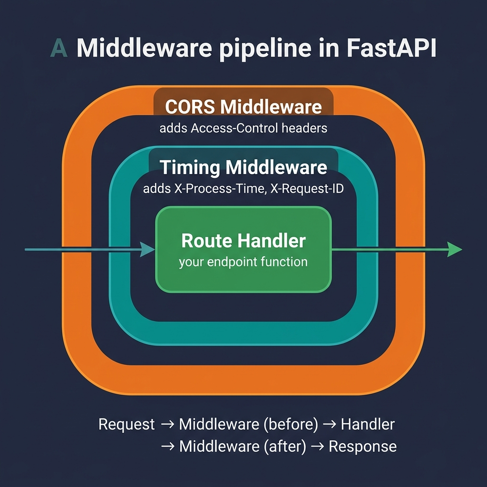

# 11 — Middleware, CORS & Lifespan Events

<p align="center">
  
</p>

## What You Will Learn

- What CORS is and how to configure it in FastAPI
- How to write custom middleware (e.g., timing, request IDs)
- How to use lifespan events for startup/shutdown resource management

---

## What is Middleware?

Middleware is code that runs on **every request and response** — before the route handler and after it. Think of it as a wrapper around your entire application:

```
Client Request
     ↓
┌──────────────────────┐
│  Middleware (before) │ ← add request ID, start timer
├──────────────────────┤
│   Route Handler      │ ← your endpoint function
├──────────────────────┤
│  Middleware (after)  │ ← add timing header, log request
└──────────────────────┘
     ↓
Client Response
```

### Common Use Cases:

| Use Case | What Middleware Does |
|----------|---|
| **CORS** | Add `Access-Control-Allow-Origin` headers |
| **Timing** | Measure request duration, add `X-Process-Time` header |
| **Request IDs** | Generate UUID, attach to response and logs |
| **Logging** | Log method, path, status code, duration |
| **Authentication** | Verify API keys or tokens globally |
| **Rate limiting** | Track request counts per client |

---

## CORS (Cross-Origin Resource Sharing)

### The Problem

Browsers enforce a security policy called the **Same-Origin Policy**. If your frontend runs on `http://localhost:3000` and your API on `http://localhost:8000`, the browser will **block** API calls unless the server explicitly allows it.

### The Solution

Add CORS middleware to tell browsers which origins are allowed:

```python
from fastapi.middleware.cors import CORSMiddleware

app.add_middleware(
    CORSMiddleware,
    allow_origins=[
        "http://localhost:3000",     # React dev server
        "http://localhost:5173",     # Vite dev server
        "https://myapp.com",        # Production frontend
    ],
    allow_credentials=True,          # Allow cookies and auth headers
    allow_methods=["*"],             # Allow all HTTP methods
    allow_headers=["*"],             # Allow all headers
)
```

### CORS Configuration Options

| Option | What It Controls | Example |
|--------|-----------------|---------|
| `allow_origins` | Which domains can call your API | `["https://myapp.com"]` |
| `allow_credentials` | Whether cookies/auth headers are allowed | `True` |
| `allow_methods` | Which HTTP methods are allowed | `["GET", "POST"]` or `["*"]` |
| `allow_headers` | Which request headers are allowed | `["Authorization"]` or `["*"]` |
| `max_age` | How long browsers cache preflight responses | `600` (seconds) |

### Security Rules

> **Never** ship `allow_origins=["*"]` with `allow_credentials=True`.
> This is a security anti-pattern that browsers will actually reject.

| Environment | `allow_origins` |
|------------|----------------|
| Development | `["http://localhost:3000", "http://localhost:5173"]` |
| Production | `["https://myapp.com"]` — exact domains only |

### How CORS Works Under the Hood

```
Browser                          Server
   │                                │
   ├── OPTIONS /api/data  ───────→  │  ← "Preflight" request
   │   Origin: http://localhost:3000│
   │                                │
   │  ←── 200 OK  ──────────────────│
   │      Access-Control-Allow-Origin: http://localhost:3000
   │                                │
   ├── GET /api/data  ───────────→  │  ← Actual request (allowed)
   │                                │
   │  ←── 200 OK + data  ───────────│
```

The browser sends a **preflight** OPTIONS request first to check if the real request is allowed.

---

## Custom Middleware

### Writing Your Own Middleware

Subclass `BaseHTTPMiddleware` to add cross-cutting logic:

```python
import time
import uuid
from starlette.middleware.base import BaseHTTPMiddleware
from starlette.requests import Request
from starlette.responses import Response

class TimingMiddleware(BaseHTTPMiddleware):
    async def dispatch(self, request: Request, call_next) -> Response:
        # --- BEFORE the endpoint ---
        request_id = str(uuid.uuid4())
        start = time.perf_counter()

        # Call the actual endpoint
        response = await call_next(request)

        # --- AFTER the endpoint ---
        duration = time.perf_counter() - start
        response.headers["X-Process-Time"] = f"{duration:.4f}"
        response.headers["X-Request-ID"] = request_id

        return response

# Register the middleware
app.add_middleware(TimingMiddleware)
```

### Middleware Execution Order

Middleware is applied in **reverse order** — the last `add_middleware()` call runs first:

```python
app.add_middleware(CORSMiddleware, ...)   # runs second
app.add_middleware(TimingMiddleware)       # runs first
```

```
Request → TimingMiddleware → CORSMiddleware → Route Handler
Response ← TimingMiddleware ← CORSMiddleware ← Route Handler
```

---

## Lifespan Events (Startup / Shutdown)

### The Problem

Some resources need to be created once at startup and cleaned up at shutdown:
- Database connection pools
- HTTP clients
- ML models
- Cache connections

### The Solution: Lifespan Context Manager

```python
from contextlib import asynccontextmanager
import httpx

@asynccontextmanager
async def lifespan(app: FastAPI):
    # ── STARTUP ──
    app.state.http = httpx.AsyncClient()
    app.state.db_ready = True
    print("App started")

    yield   # ← app runs and serves requests here

    # ── SHUTDOWN ──
    await app.state.http.aclose()
    print("App stopped")

app = FastAPI(lifespan=lifespan)
```

### Execution Flow

```
Server starts
    │
    ├── lifespan() runs up to `yield`
    │   └── creates shared resources
    │
    ├── ════ app serves requests ════
    │   └── endpoints can use app.state.http
    │
    ├── Ctrl+C / shutdown signal
    │
    └── lifespan() continues after `yield`
        └── closes shared resources
```

### Accessing Shared Resources in Endpoints

Use `request.app.state` to access resources created during startup:

```python
@app.get("/joke")
async def joke(request: Request):
    r = await request.app.state.http.get(
        "https://official-joke-api.appspot.com/random_joke"
    )
    return r.json()
```

### Why Not `@app.on_event`?

The older `@app.on_event("startup")` / `@app.on_event("shutdown")` pattern is **deprecated** in favor of `lifespan`. The context manager approach:

- Keeps startup and shutdown code together
- Makes resource management explicit
- Follows Python best practices (`async with`)

---

## Code Examples

→ See `examples/11_middleware/`

| File | Concept |
|------|---------|
| `cors_example.py` | CORSMiddleware setup |
| `custom_middleware.py` | TimingMiddleware with process time + request ID |
| `lifespan_example.py` | Lifespan with shared httpx client |
