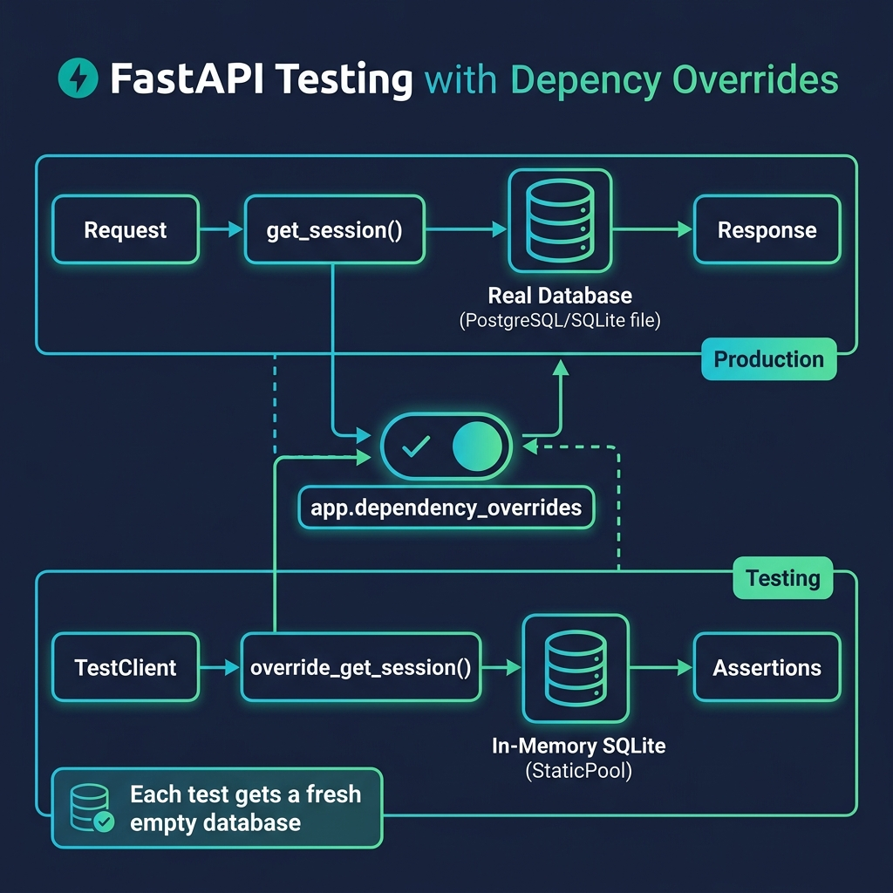

# 12 — Testing

<p align="center">
  
</p>

## What You Will Learn

- How to test FastAPI apps with `TestClient` (no server needed)
- How to write pytest test functions and fixtures
- How to override dependencies for isolated database tests

---

## TestClient

`TestClient` drives your app in-process — no sockets, no server:

```python
from fastapi.testclient import TestClient
client = TestClient(app)

def test_root():
    r = client.get("/")
    assert r.status_code == 200
```

You can call any HTTP method: `client.get()`, `client.post(json=...)`, `client.patch()`, `client.delete()`, and `client.post(data=...)` for form data.

---

## Pytest Fixtures

Fixtures provide setup/teardown for each test:

```python
@pytest.fixture(name="client")
def client_fixture(session):
    def override():
        yield session
    app.dependency_overrides[get_session] = override
    yield TestClient(app)
    app.dependency_overrides.clear()
```

---

## Database Testing with StaticPool

Swap the real DB for an in-memory SQLite database using `dependency_overrides`:

```python
from sqlmodel.pool import StaticPool

test_engine = create_engine(
    "sqlite://",
    connect_args={"check_same_thread": False},
    poolclass=StaticPool,
)
SQLModel.metadata.create_all(test_engine)
```

**Why StaticPool?** SQLite in-memory databases are connection-scoped. `StaticPool` forces all connections to share the same in-memory database within a test. Without it, different connections see different empty databases.

---

## Test Isolation

Each test gets a fresh `session_fixture` → brand new in-memory database → no data leakage between tests:

```python
def test_first(client):
    client.post("/heroes", json={"name": "Ada"})  # creates 1 hero

def test_second(client):
    assert client.get("/heroes").json() == []      # empty — fresh DB
```

---

## Testing Auth Endpoints

```python
def get_auth_headers(client, username="testuser", password="testpass123"):
    client.post("/register", json={"username": username, "password": password})
    r = client.post("/login", data={"username": username, "password": password})
    token = r.json()["access_token"]
    return {"Authorization": f"Bearer {token}"}

def test_protected(client):
    headers = get_auth_headers(client)
    assert client.get("/me", headers=headers).status_code == 200

def test_no_auth(client):
    assert client.get("/me").status_code == 401
```

---

## Key Patterns

- **Fixtures** — `@pytest.fixture` with `yield` for setup/teardown
- **Isolation** — each test gets a fresh DB
- **Override cleanup** — always `app.dependency_overrides.clear()`
- **Auth in tests** — get token first, then `headers={"Authorization": f"Bearer {token}"}`

---

## Running Tests

```bash
pytest tests/ -v              # all tests, verbose
pytest tests/test_heroes.py -v # single file
pytest tests/ -v -x           # stop on first failure
pytest tests/ -v -s           # show print output
```

---

## Code Examples

→ See `examples/12_testing/` for self-contained learning examples
→ See `tests/` at the repo root for tests against the main app
