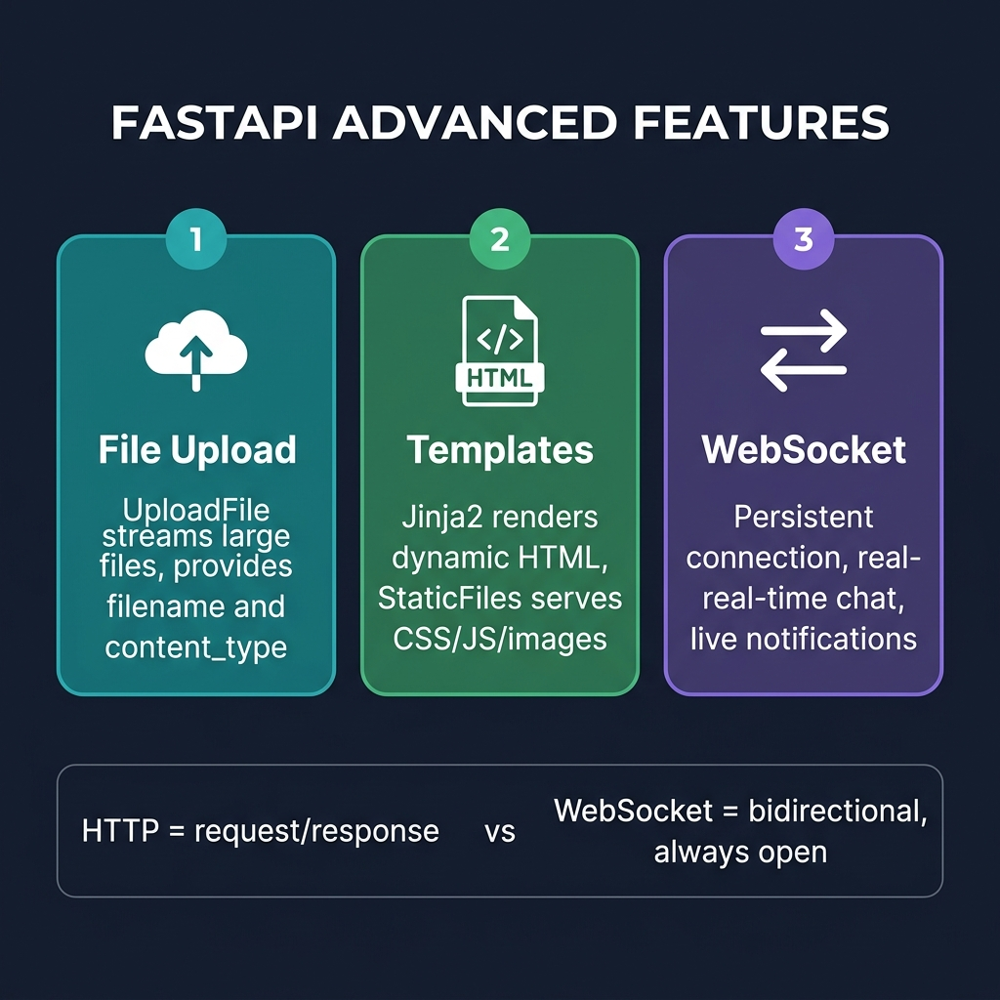

# 13 — Advanced Features

<p align="center">
  
</p>

## What You Will Learn

- How to handle file uploads (single and multiple)
- How to serve static files and render HTML templates with Jinja2
- How to create WebSocket endpoints for real-time communication

---

## File Uploads

### Single File Upload

`UploadFile` streams the body — ideal for large files:

```python
from fastapi import UploadFile

@app.post("/upload")
async def upload(file: UploadFile):
    contents = await file.read()
    return {
        "filename": file.filename,
        "content_type": file.content_type,
        "size": len(contents),
    }
```

### Multiple File Upload

```python
@app.post("/upload-many")
async def upload_many(files: list[UploadFile]):
    results = []
    for f in files:
        data = await f.read()
        results.append({"name": f.filename, "size": len(data)})
    return results
```

### UploadFile Properties

| Property | Type | Description |
|----------|------|-------------|
| `filename` | `str` | Original filename from the client |
| `content_type` | `str` | MIME type (e.g., `image/png`) |
| `file` | `SpooledTemporaryFile` | The actual file object |
| `read()` | `async` | Read the file contents |
| `seek(0)` | `async` | Reset file position to beginning |
| `close()` | `async` | Close the file |

### UploadFile vs `bytes`

| | `UploadFile` | `file: bytes` |
|---|---|---|
| **Memory** | Streamed, spooled to disk for large files | Entire file in memory |
| **Max size** | Unlimited (practically) | Limited by available RAM |
| **Metadata** | Has `filename`, `content_type` | None |
| **Use for** | Large files, real applications | Small files, quick demos |

---

## Static Files & Templates

### Serving Static Files

Mount a directory to serve CSS, JS, images, etc.:

```python
from pathlib import Path
from fastapi.staticfiles import StaticFiles

BASE_DIR = Path(__file__).resolve().parent

app.mount(
    "/static",                            # URL prefix
    StaticFiles(directory=BASE_DIR / "static"),  # filesystem directory
    name="static",                        # name for URL generation
)
```

> **Tip:** Always use `Path(__file__).resolve().parent` for directory paths.
> This ensures the path works regardless of which directory you run `uvicorn` from.

### Jinja2 Templates

Render HTML with dynamic data:

```python
from fastapi import Request
from fastapi.templating import Jinja2Templates

templates = Jinja2Templates(directory=BASE_DIR / "templates")

@app.get("/page/{name}")
def page(name: str, request: Request):
    return templates.TemplateResponse(
        name="hello.html",
        request=request,
        context={"name": name},
    )
```

Template file (`templates/hello.html`):
```html
<!DOCTYPE html>
<html>
<body>
    <h1>Hello, {{ name }}!</h1>
    <link rel="stylesheet" href="/static/style.css">
</body>
</html>
```

---

## WebSockets

### What Are WebSockets?

HTTP is request-response — the client asks, the server answers, connection closes. WebSockets are **bidirectional and persistent** — both sides can send messages at any time.

| | HTTP | WebSocket |
|---|---|---|
| **Direction** | Client → Server → Client | Both ways, any time |
| **Connection** | Opens and closes per request | Stays open |
| **Use case** | REST APIs, page loads | Chat, notifications, live data |

### Basic WebSocket Endpoint

```python
from fastapi import WebSocket, WebSocketDisconnect

@app.websocket("/ws")
async def ws_endpoint(ws: WebSocket):
    await ws.accept()
    try:
        while True:
            msg = await ws.receive_text()
            await ws.send_text(f"echo: {msg}")
    except WebSocketDisconnect:
        print("Client disconnected")
```

### Broadcasting to Multiple Clients

```python
clients: list[WebSocket] = []

@app.websocket("/ws")
async def ws_endpoint(ws: WebSocket):
    await ws.accept()
    clients.append(ws)
    try:
        while True:
            msg = await ws.receive_text()
            for client in clients:
                await client.send_text(f">> {msg}")
    except WebSocketDisconnect:
        clients.remove(ws)
```

### WebSocket Methods

| Method | Purpose |
|--------|---------|
| `await ws.accept()` | Accept the connection |
| `await ws.receive_text()` | Wait for a text message |
| `await ws.receive_json()` | Wait for a JSON message |
| `await ws.send_text(msg)` | Send a text message |
| `await ws.send_json(data)` | Send a JSON message |
| `await ws.close()` | Close the connection |

---

## Code Examples

→ See `examples/13_advanced/`

| File | Concept |
|------|---------|
| `file_upload.py` | Single & multi uploads |
| `static_templates.py` | StaticFiles + Jinja2 |
| `websocket_chat.py` | WebSocket broadcast chat |
