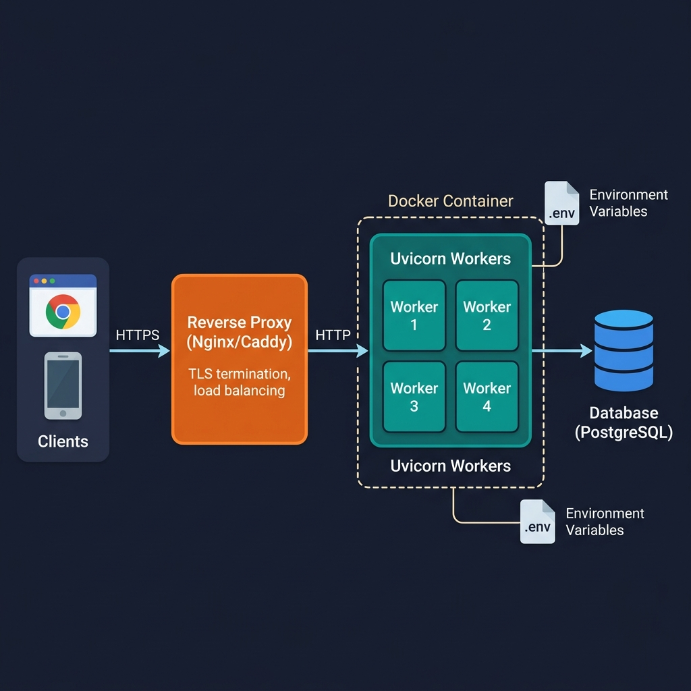

# 14 — Deployment

<p align="center">
  
</p>

## What You Will Learn

- How to run FastAPI in production with Uvicorn and Gunicorn
- How to write a production Dockerfile
- The production readiness checklist

---

## Development vs Production

| | Development | Production |
|---|---|---|
| **Command** | `uvicorn app:app --reload` | `uvicorn app:app --workers 4` |
| **Reload** | Yes (auto-restart on changes) | No (stability) |
| **Workers** | 1 | Multiple (CPU cores × 2 + 1) |
| **Debug** | Detailed tracebacks | Minimal error info |
| **Docs** | `/docs` enabled | Consider disabling |
| **Secrets** | `.env` file | Environment variables |
| **Database** | SQLite, `create_all` | PostgreSQL, Alembic migrations |
| **HTTPS** | Not needed | Required |

---

## Running in Production

### Single Process

```bash
uvicorn app.main:app --host 0.0.0.0 --port 8000
```

- `--host 0.0.0.0` makes the server accessible from outside (not just localhost)
- No `--reload` in production

### Multiple Workers

```bash
uvicorn app.main:app --host 0.0.0.0 --port 8000 --workers 4
```

**Rule of thumb:** `workers = (2 × CPU cores) + 1`

| CPU Cores | Workers |
|-----------|---------|
| 1 | 3 |
| 2 | 5 |
| 4 | 9 |

### Gunicorn with Uvicorn Workers (Linux)

Gunicorn is a **process manager** that supervises Uvicorn workers, providing auto-restarts and graceful reloads:

```bash
gunicorn app.main:app \
    -k uvicorn.workers.UvicornWorker \
    -w 4 \
    -b 0.0.0.0:8000
```

| Flag | Meaning |
|------|---------|
| `-k uvicorn.workers.UvicornWorker` | Use async Uvicorn workers |
| `-w 4` | Number of worker processes |
| `-b 0.0.0.0:8000` | Bind address and port |

> **Note:** Gunicorn does not run on Windows. Use Uvicorn with `--workers` on Windows.

---

## Docker

### Why Docker?

- **Consistency** — same environment everywhere (dev, staging, production)
- **Isolation** — dependencies don't conflict with the host system
- **Portability** — deploy to any cloud provider
- **Reproducibility** — builds are deterministic

### Production Dockerfile

```dockerfile
FROM python:3.12-slim

WORKDIR /app

ENV PYTHONDONTWRITEBYTECODE=1 \
    PYTHONUNBUFFERED=1

# Install dependencies first (layer caching)
COPY requirements.txt .
RUN pip install --no-cache-dir -r requirements.txt

# Copy application code
COPY ./app ./app

EXPOSE 8000

CMD ["uvicorn", "app.main:app", "--host", "0.0.0.0", "--port", "8000"]
```

### Key Decisions Explained

| Decision | Why |
|----------|-----|
| `python:3.12-slim` | ~150MB vs ~900MB for full image |
| `PYTHONDONTWRITEBYTECODE=1` | Don't create `.pyc` files (saves space) |
| `PYTHONUNBUFFERED=1` | Print output appears immediately in logs |
| Copy `requirements.txt` first | Docker caches this layer — faster rebuilds |
| `--no-cache-dir` | Don't store pip cache in the image |

### Build and Run

```bash
docker build -t fastapi-app .
docker run -d -p 8000:8000 fastapi-app
```

---

## Environment Variables

### Never hardcode secrets:

```python
# BAD
SECRET_KEY = "my-secret-key"

# GOOD
import os
SECRET_KEY = os.getenv("SECRET_KEY")

# BEST — use pydantic-settings
from pydantic_settings import BaseSettings
class Settings(BaseSettings):
    secret_key: str
```

### Setting Environment Variables

```bash
# Linux/Mac
export SECRET_KEY="your-production-secret"

# Docker
docker run -e SECRET_KEY="your-secret" -p 8000:8000 fastapi-app

# Docker Compose
environment:
  - SECRET_KEY=your-secret
```

---

## Health Checks

Every production API needs a `/health` endpoint for load balancers and orchestrators:

```python
@app.get("/health")
def health():
    return {"status": "ok"}
```

Kubernetes uses two types of probes:

| Probe | Endpoint | Question |
|-------|----------|----------|
| **Liveness** | `/health` | Is the process alive? |
| **Readiness** | `/health/ready` | Can it accept traffic? |

---

## HTTPS

**Never** run HTTP in production. Use a reverse proxy to terminate TLS:

```
Client ──HTTPS──→ Nginx/Caddy ──HTTP──→ Uvicorn
                  (handles TLS)         (port 8000)
```

Popular reverse proxies: **Nginx**, **Caddy** (auto-HTTPS), **Traefik**, cloud load balancers.

---

## Production Checklist

| ✓ | Item | Why |
|---|------|-----|
| ☐ | Secrets in env vars, not in code | Prevent leaks in version control |
| ☐ | HTTPS via reverse proxy | Encrypt all traffic |
| ☐ | CORS locked down to exact origins | Prevent cross-origin attacks |
| ☐ | Alembic for DB migrations | Safe schema changes with rollback |
| ☐ | Structured logging + `/health` | Observability and monitoring |
| ☐ | Disable `/docs` in production | Don't expose API schema publicly |
| ☐ | Workers tuned: (2 × CPU) + 1 | Maximize throughput |
| ☐ | Database backups + tested restores | Disaster recovery |
| ☐ | Rate limiting | Prevent abuse |
| ☐ | Error monitoring (Sentry, etc.) | Catch errors in production |

---

## Code Examples

→ See `examples/14_deployment/`

| File | Concept |
|------|---------|
| `health_check.py` | Health + readiness endpoints |
| `settings_demo.py` | pydantic-settings with `.env` |
| `logging_demo.py` | Structured logging + request IDs |
| `Dockerfile.reference` | Annotated production Dockerfile |
